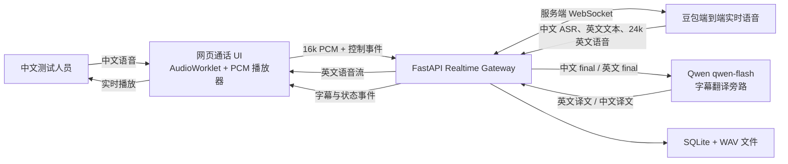

# 豆包端到端英文客服语音 Demo 设计

- 日期：2026-08-02
- 状态：核心方案已确认，进入实现
- 实现语言：Python
- 产品形态：本地网页模拟通话，不接真实电话
- 主语音链路：豆包端到端实时语音
- 字幕翻译旁路：Qwen `qwen-flash`

## 1. 已确认的产品行为

测试人员使用中文说话，豆包端到端模型直接理解中文音频，并以英语外呼客服身份生成英文文本和英文语音。网页实时播放英文客服原声，不生成中文译声。

页面并行展示并在通话后保存两组文本：

1. 测试人员中文 ASR 原文，以及 Qwen 生成的英文译文；
2. 豆包客服英文回复原文，以及 Qwen 生成的中文译文。

Qwen 仅承担字幕和审计翻译，不参与豆包的对话控制链，也不阻塞英文语音首包。首版只翻译 final 文本，不翻译不断变化的 partial 文本，避免字幕抖动、乱序和费用放大。

## 2. 对现有实现的影响

仓库已有 FastAPI、SQLite、Mock/Ark 文本 Provider、会话复盘、评分、JSON/CSV 导出，以及基于浏览器 `SpeechRecognition`、`MediaRecorder`、`speechSynthesis` 的演示链路。

本次采用增量式改造：

- 保留 REST 历史、复盘、评分、导出、删除和离线 Mock 能力；
- 新增浏览器到 FastAPI 的实时 WebSocket；
- 新增 FastAPI 到豆包的服务端 WebSocket；
- 使用 Web Audio/AudioWorklet 替换实时链路中的浏览器 ASR 和浏览器 TTS；
- 新增独立的 Qwen 字幕翻译 Adapter；
- 不把流式语音能力塞入现有 `ConversationProvider.translate/reply` 接口；
- 实时模式只有一个会话启动入口，避免 REST 和豆包分别生成两次开场白。

真实豆包模式出错时不得静默切换到 Mock、浏览器 ASR 或浏览器 TTS。不同链路的结果不能在没有标记的情况下混入同一测试会话。

## 3. 方案比较与决定

### 方案 A：FastAPI 进程内实时网关（采用）

浏览器只连接 FastAPI。FastAPI 负责豆包鉴权、协议编解码、事件归一化、Qwen 字幕翻译和持久化。

优点是密钥不会进入浏览器、与现有 Python 应用集成成本低、适合单机内部 Demo。首版的会话规模较小，不需要额外消息队列或媒体服务。

### 方案 B：独立媒体网关

把音频转码、队列和云端连接拆成独立服务。它适合多实例和大量并发，但会增加部署、监控和状态同步成本，超出当前“先能跑”的范围。

### 方案 C：浏览器直连豆包

浏览器无法安全保存长期凭证，也不能可靠设置豆包握手所需的自定义鉴权头。该方案不采用。

## 4. 总体架构



浏览器绝不直接获得豆包、DashScope 或其他供应商密钥。

## 5. 组件边界

### 5.1 浏览器实时音频层

职责：

- 在用户点击开始通话时请求麦克风权限并创建 `AudioContext`；
- 通过 AudioWorklet 采集设备音频；
- 将 44.1kHz/48kHz 等实际输入重采样为 16kHz、单声道、PCM16LE；
- 首版沿用页面麦克风按钮：点击开始实时收音，再次点击提交本轮；
- 以约 40ms 的浏览器分片发送，后端按豆包协议需要重新切分；
- 接收 24kHz、单声道、PCM16LE 音频并按序播放；
- 打断时立即清空本地播放队列，再发送取消事件；
- 监控 WebSocket `bufferedAmount`，超出上限时停止继续堆积。

实时音频不能依赖 `getUserMedia({sampleRate: 16000})`，因为浏览器可能忽略该约束。AudioContext 必须由用户点击触发，以兼容 Safari/iOS 的自动播放限制。首版以最新版 Chrome/Edge 和 localhost 为验收环境。

### 5.2 浏览器实时协议层

新增独立模块管理 WebSocket、心跳、事件校验、序号和连接 generation。旧连接产生的迟到事件不得更新新会话 UI。

首版在浏览器和 FastAPI 之间使用 JSON + base64 音频。其带宽约为输入 43KB/s、输出 64KB/s，足够本地内部 Demo；后续如需扩容，再升级为带类型头的二进制帧。

### 5.3 Realtime Gateway

每个浏览器连接对应一个隔离的会话协调器，负责：

- 创建和结束 SQLite 会话；
- 建立、管理和关闭豆包 WebSocket；
- 并发处理浏览器上行、豆包下行、字幕翻译和持久化；
- 为事件分配单调递增序号；
- 控制有界队列、取消、超时和清理；
- 把厂商事件转换成稳定的浏览器事件。

建议模块边界：

- `app/realtime/browser_protocol.py`：浏览器协议和事件校验，不含网络 I/O；
- `app/realtime/doubao_protocol.py`：豆包二进制协议编解码和边界校验；
- `app/realtime/doubao.py`：豆包鉴权、连接、事件映射、取消和关闭；
- `app/realtime/qwen.py`：`SubtitleTranslator` 接口及 Qwen 实现；
- `app/realtime/state.py`：纯状态转换和迟到/重复事件处理；
- `app/realtime/audio.py`：受限 PCM/WAV 写入和按键说话音频分段；
- `app/realtime/gateway.py`：会话并发编排与背压；
- `app/realtime/persistence.py`：将 final 文本和音频写入现有会话模型。

`app/main.py` 只负责配置、依赖注入和 WebSocket 路由。

### 5.4 豆包 Adapter

豆包 Adapter 是唯一了解厂商协议的模块。它把供应商事件归一化为：

- 用户 ASR partial/final；
- 用户话语结束；
- 客服英文文本 delta/final；
- 客服英文 PCM 音频 chunk/done；
- TTS 句子开始/结束；
- 会话、取消和错误事件。

豆包内置的语音输出属于端到端模型能力，不抽象成独立可替换的 TTS Provider。

### 5.5 Qwen 字幕翻译 Adapter

Qwen 使用 `qwen-flash`、低随机性和固定翻译提示词。翻译必须保留数字、金额、日期、专有名词和否定关系，不得解释、回答或扩写原文。

翻译方向：

- 中文用户 ASR final：中文到英文；
- 英文客服文本 final：英文到中文。

翻译可以晚于英语音频播放完成。Qwen 超时或失败时，豆包通话继续，页面明确显示“字幕翻译失败”，数据库保存原文和失败状态，不生成伪译文。

## 6. 浏览器 WebSocket 协议

所有 JSON 事件使用统一 envelope：

```json
{
  "v": 1,
  "type": "session.start",
  "event_id": "client-generated-id",
  "session_id": null,
  "turn_id": null,
  "seq": 1,
  "ts_ms": 1785600000000,
  "payload": {}
}
```

### 6.1 浏览器发往后端

- `session.start`：选择预置场景并开始会话；
- `input_audio.append`：16kHz PCM16LE base64 分片；
- `input_audio.commit`：手动结束一次语音输入，后端映射为豆包 `EndASR`；
- `user.text.submit`：麦克风不可用时提交中文文字；
- `response.cancel`：用户打断当前客服音频；
- `session.end`：挂断；
- `ping`：连接保活。

浏览器只能提交允许的场景 ID，不能提交任意 system prompt、模型名、音色或供应商参数。

### 6.2 后端发往浏览器

- `session.ready`：豆包连接和会话初始化完成；
- `session.state`：连接、收听、客服说话、结束或错误；
- `asr.partial` / `asr.final`：中文实时/最终原文；
- `user.translation.done`：用户中文原文的英文译文；
- `assistant.text.delta` / `assistant.text.done`：客服英文文本；
- `assistant.translation.done`：客服英文文本的中文译文；
- `assistant.audio.chunk` / `assistant.audio.done`：24kHz 英文 PCM；
- `turn.completed`：已持久化的完整话轮；
- `session.ended`：服务器已完成清理；
- `error`：脱敏且标记是否可恢复的错误；
- `pong`：心跳响应。

所有事件都携带会话 ID、序号；与具体回复相关的事件还携带 turn ID、response ID 和音频 chunk 序号。前端只接受当前 connection generation 且序号合法的事件。

## 7. 端到端数据流

### 7.1 开始模拟外呼

1. 用户点击开始，浏览器打开 WebSocket 并发送 `session.start`；
2. 后端校验场景和 Origin，创建 SQLite 会话；
3. 后端使用环境变量中的凭证连接豆包；
4. 后端发送固定的英语外呼客服角色、场景话术、英语音色和音频参数；
5. 豆包生成英文开场白文本和音频；
6. 英文音频立即流式播放，英文文本 final 并行交给 Qwen 生成中文字幕；
7. 原文、译文、模型、耗时和英文音频写入会话记录。

### 7.2 中文测试人员说话

1. 测试人员点击麦克风按钮后，音频持续发送给 FastAPI，再转发给豆包；
2. 豆包 ASR partial 立即显示，但不进入正式评测；
3. 豆包 ASR final 形成测试人员中文原文；
4. 中文 final 异步交给 Qwen 翻译成英文审计字幕；
5. 豆包直接根据中文音频和上下文生成英文客服回答，不等待 Qwen；
6. 豆包英文文本和英文音频分别流回网页；
7. 英文文本 final 异步翻译成中文字幕；
8. 用户话轮和客服话轮最终写入 SQLite，并与各自 WAV 文件关联。

### 7.3 打断

测试人员在客服播放期间点击麦克风按钮开始说话时：

1. 前端立即清空尚未播放的音频；
2. 前端发送 `response.cancel`；
3. 后端通过豆包按键收音模式的 `ClientInterrupt` 事件取消旧回复，并丢弃该 response ID 的迟到音频；
4. 已生成的客服英文原文和中文字幕保留；
5. 客服话轮标记为 `interrupted`；
6. 新的用户语音继续进入豆包，不重建整个会话。

## 8. 状态与顺序

全双工通话不使用一个全局 `processing` 布尔值表达所有状态。至少分别跟踪：

- 连接：`created → connecting → active → draining → ended`，异常进入 `failed`；
- 用户话语：`open → finalized | interrupted | failed`；
- 客服回复：`created → streaming → completed | cancelled | failed`；
- 字幕翻译：`queued → running → completed | failed | superseded`。

重复或迟到的供应商事件通过 provider event ID、response ID 和本地序号去重。只有 final 文本形成正式话轮；partial 只用于当前 UI。

## 9. 配置和模型

现有 `PROVIDER_MODE=mock|ark` 继续用于 REST 文本演示。实时链路使用独立配置：

```dotenv
REALTIME_PROVIDER=disabled
DOUBAO_REALTIME_WS_URL=wss://openspeech.bytedance.com/api/v3/realtime/dialogue
DOUBAO_APP_ID=
DOUBAO_ACCESS_KEY=
DOUBAO_RESOURCE_ID=volc.speech.dialog
DOUBAO_APP_KEY=
DOUBAO_TTS_SPEAKER=
DOUBAO_INPUT_SAMPLE_RATE=16000
DOUBAO_OUTPUT_SAMPLE_RATE=24000
DOUBAO_CONNECT_TIMEOUT_SECONDS=15
DOUBAO_RECV_TIMEOUT_SECONDS=10
QWEN_SUBTITLE_ENABLED=false
DASHSCOPE_API_KEY=
QWEN_SUBTITLE_MODEL=qwen-flash
QWEN_TIMEOUT_SECONDS=10
WS_ALLOWED_ORIGINS=http://127.0.0.1:8000,http://localhost:8000
```

仓库只提交空值或占位符。启用 `REALTIME_PROVIDER=doubao` 时，缺少豆包必填配置必须拒绝启动；启用 Qwen 字幕时缺少 DashScope Key 也必须拒绝启动。

用户提供的中文男声音色与“英语客服原声”冲突，不能作为默认值。`DOUBAO_TTS_SPEAKER` 必须填写当前账号实际开通的英语音色；O2.0 权限和具体 voice ID 以控制台和真实连接为准。

角色指令固定在服务端，要求模型：

- 扮演专业、简洁、自然的英语外呼客服；
- 理解测试人员的中文，但回复内容和语音始终使用英语；
- 根据预置场景主动开场、一次只问一个问题；
- 不声称真实拨号，不索取不必要的个人敏感信息；
- 在用户要求结束时礼貌结束。

## 10. 持久化

首版复用现有 `sessions` 和 `turns` 最终视图，满足复盘、评分和 JSON/CSV 导出：

- 测试人员话轮：中文 `source_text`、英文 `translated_text`、中文输入 WAV；
- 客服话轮：英文 `source_text`、中文 `translated_text`、英文输出 WAV；
- `model` 保存脱敏后的豆包资源/音色和 Qwen 模型标识；
- `latency_ms` 保存该话轮从 final 输入到首段输出或字幕完成的可解释耗时；
- `interrupted` 标记被打断的客服回复；
- 翻译失败时保留原文、空译文和安全错误码。

音频流写入有大小和时长上限的临时 WAV，话轮完成后原子改名；不把整段音频或音频 chunk 写入 SQLite。删除会话时继续删除关联音频。

首版不新增完整事件审计表。若后续需要生产级追踪，再增加 provider call/event 表，而不是把大量 partial 和音频分片塞入现有 `turns`。

## 11. 错误处理与安全

| 故障 | 行为 |
|---|---|
| 麦克风权限或 AudioWorklet 不可用 | 禁用麦克风并保留中文文字输入；不伪装成真实语音测试 |
| 豆包鉴权、协议或模型权限错误 | 终止实时会话，显示脱敏错误；不降级到 Mock |
| 豆包通话中断线 | 停止播放并结束当前会话；首版不自动恢复上下文或重复开场 |
| Qwen 超时、限流或响应无效 | 英文语音继续；原文保存，译文标为失败并允许后续重试 |
| 客户端帧过大或协议非法 | 使用 WebSocket 1009/1008 关闭，不转发上游 |
| 音频或消息队列超过上限 | 中止会话并返回可重试的繁忙错误，避免内存无限增长 |
| 用户挂断 | 取消所有子任务、关闭上游、落盘已完成话轮并清理临时文件 |

安全要求：

- 所有密钥仅从后端环境变量读取；
- 日志、异常、健康接口、SQLite 和导出文件不得包含密钥或完整鉴权头；
- 健康接口只显示能力是否启用和模型名称；
- 校验 Origin、场景 ID、消息大小、采样率、会话时长和并发数；
- 只允许 `wss://` 豆包地址；
- 非 loopback 部署前必须增加用户身份认证；
- 录音前明确提示内部测试和录音用途，使用者同意后才启动麦克风；
- 当前对话中曾展示过的所有旧凭证必须轮换，不能用于验收。

## 12. 测试设计

### 12.1 默认自动化测试

自动化测试不访问真实云服务，也不读取真实凭证：

- 配置矩阵：禁用、必填项缺失、非法 URL、英语音色缺失、秘密不出现在 `repr` 和错误中；
- 浏览器协议：事件 schema、序号、大小限制、base64 和 PCM 参数校验；
- 音频：44.1kHz/48kHz 到 16kHz 重采样、PCM16 裁剪/小端序、24kHz 顺序播放和取消；
- 豆包 Adapter：使用 fake WebSocket 和脱敏事件夹具覆盖握手、ASR、文本、音频、取消、鉴权失败和断线；
- Qwen Adapter：使用 `httpx.MockTransport` 覆盖双向翻译、超时、429 和畸形响应；
- 状态机：重复、乱序、迟到事件、打断、挂断和清理；
- 网关集成：浏览器 WebSocket → 假豆包 → 假 Qwen → SQLite/WAV；
- 兼容性：现有历史、评分、导出和删除测试继续通过；
- 静态契约：不再把浏览器 `SpeechRecognition`、`speechSynthesis` 当作实时链路依赖。

### 12.2 真实服务冒烟

真实测试单独运行并要求轮换后的本机环境变量：

1. 网页完成豆包握手并收到英文开场白；
2. 中文说话时出现 ASR partial 和 final；
3. final 后出现英文审计译文；
4. 豆包生成英文回复文本和可连续播放的 24kHz 英文音频；
5. 英文回复出现中文字幕；
6. 打断能停止旧音频且会话继续；
7. 挂断后可复盘双语文本并回放中英文各自的源音频；
8. 日志、浏览器网络响应、SQLite 和导出中没有密钥。

记录以下指标，但在完成真实基线前不虚构 SLA：

- 采集开始到首个 ASR partial；
- 用户说完到英文回复首字；
- 用户说完到英文音频首包及可播放首包；
- 英文 final 到中文字幕完成；
- 播放 underrun 和断线次数。

## 13. 首版验收标准

- 无真实电话线路即可在网页完成一次模拟外呼；
- 中文语音输入能驱动豆包输出英语客服文本和英语客服语音；
- 页面显示中文用户原文、英文用户译文、英文客服原文、中文客服译文；
- 英语音频边生成边播放，不等待 Qwen 翻译完成；
- 连续完成至少 10 轮，不串会话、不重复开场、不播放已取消音频；
- 挂断后可查看、评分、导出和删除本次会话；
- Mock 自动化链路无需密钥可运行；
- 真实链路缺少权限、英语音色或凭证时明确失败，不伪装成功；
- 所有自动化测试、Python 依赖检查和前端语法检查通过。

## 14. 首版不做

- 真实电话、SIP、号码和运营商接入；
- 中文译声或双路音频同时播放；
- 独立 ASR/LLM/TTS 级联主链路；
- 多语种、生产级多租户、高可用和跨实例会话恢复；
- 浏览器保存供应商长期凭证；
- 翻译每一条 ASR partial；
- 用 Mock 结果作为真实模型验收证据。

## 15. 主要风险

| 风险 | 缓解 |
|---|---|
| 账号未开通英语音色或 O2.0 | 启动前严格校验 voice ID；以控制台和真实握手验证，不硬编码中文音色 |
| 模型偶尔不遵守只说英语 | 使用固定英语角色提示词；真实冒烟记录违规话轮，必要时再评估级联方案 |
| Qwen 字幕落后语音 | 翻译 final 且不阻塞音频；UI 清楚显示“翻译中” |
| 浏览器回声造成自问自答 | 开启回声消除；推荐耳机；打断和回复 ID 防止旧音频回放 |
| WebSocket 事件乱序或迟到 | connection generation、session/turn/response ID、序号和有界队列 |
| 厂商协议或事件字段变更 | 所有厂商字段限制在 Adapter；用脱敏夹具和协议测试锁定当前行为 |

## 16. 决策记录

1. 用户明确选择豆包端到端实时语音作为主链路；
2. 输入为中文语音，客服以英文文本和英文语音回复；
3. 通话中只播放英文客服原声；
4. Qwen `qwen-flash` 只生成中英双向审计字幕；
5. 浏览器通过 FastAPI 代理连接豆包，不持有供应商凭证；
6. 首版采用 Python 进程内实时网关，不引入独立媒体服务；
7. 保留现有复盘、评分、导出、删除和 Mock 能力；
8. 真实服务失败不静默降级；
9. 用户提供的旧凭证视为已泄露，必须轮换并只放在本机环境变量中。
10. 首版使用豆包 `push_to_talk` 模式，以匹配现有麦克风按钮和官方 `EndASR`/`ClientInterrupt` 协议；常开麦克风不进入首版。

## 17. 参考资料

- [豆包端到端实时语音 Realtime API](https://www.volcengine.com/docs/6561/1594356)
- [豆包端到端实时语音产品简介](https://www.volcengine.com/docs/6561/1594360)
- [豆包语音模型列表](https://www.volcengine.com/docs/6561/2499930)
- [阿里云百炼模型服务](https://help.aliyun.com/zh/model-studio/)

产品能力、事件字段、英语音色、配额和价格会变化。正式联调以当前账号控制台、官方文档和真实 API 响应为准。
